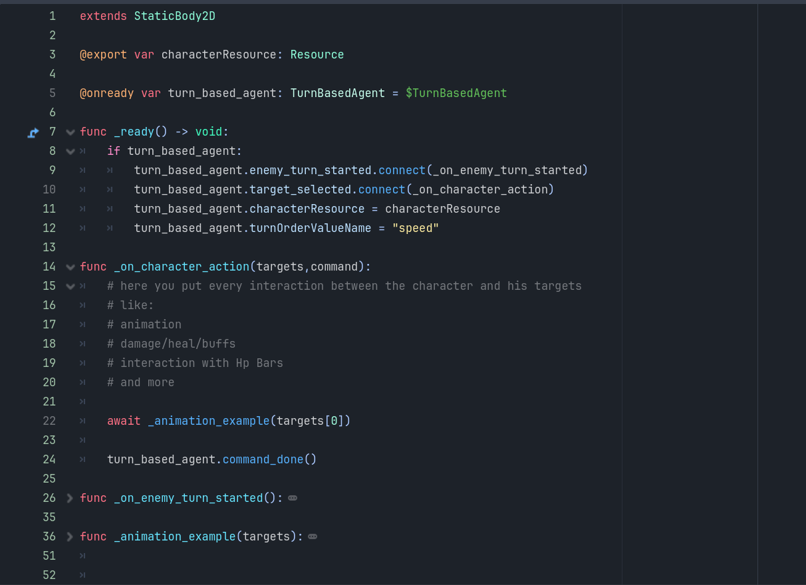

# Turn-Based-System-Plugin
 
A flexible Turn Based System for Godot version 4.x

## 🌟 Highlights
- 2D and 3D Support
- Different turn based combat systems:
	- classic
	- value based
	- dynamic

## 🚀 Usage
###  TurnBasedController - Add it to your main scene to activate the Turn Based System

###  TurnBasedAgent - Add it to your Character (Player or Enemy)
The Agent needs the character resource where the Commands (attack/skill/item resources) are saved.
The TurnOrderValue will be checked in the character Resource too.  
Like this: 

 

###  Command Menu - Add it in a Canvas Layer at the end of the main scene
The main command list have to be filled to get the Commands in the menu. It's a little complicated
In this List you set a Dictonary with the shown Command name (dict key) and the reference to your character resource (dict value) 
Example: [{"Attack": "basicAttack"}, {"Skills": "skills"}, {"Items": "items"}] 

###  Turn Order Bar *optional* - Add it in a Canvas Layer at the end of the main scene 

### Character Setup: 

## ⬇️ Installation
If you don't have a "addons" folder in your project tree:

	copy the "addons" folder in your project tree
	
elif you have a "addons" folder already:

	copy the "Turn_Based_System" folder in your "addons" folder

At the end it should look like this:

## 💭 Feedback and Contributing
You are always welcome to open issues for improvements or bugs:
https://github.com/derdrache/DragAndDrop3D/issues

Let's discuss wishes and improvements:
https://github.com/derdrache/DragAndDrop3D/discussions

or with a pull request to extend the code (there are no guidelines)
