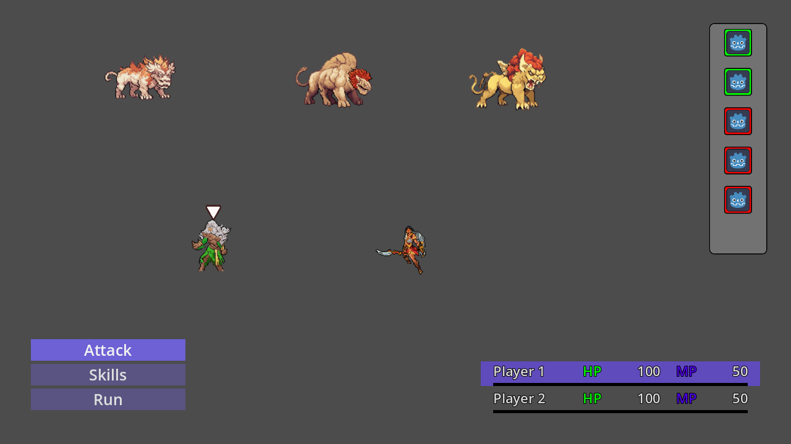
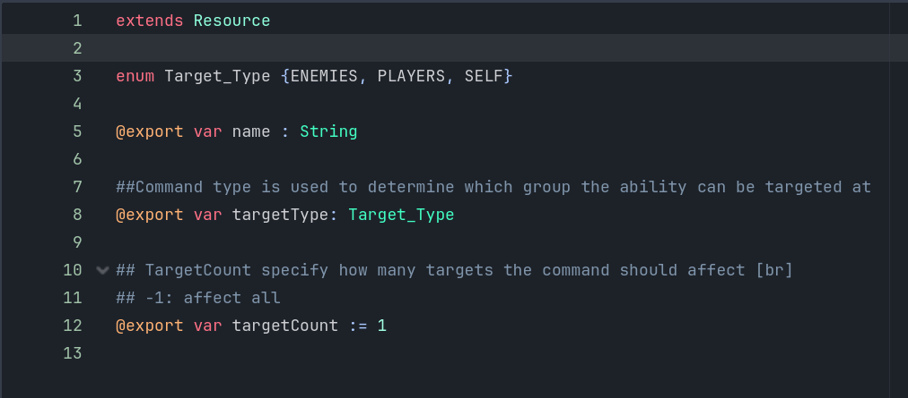

# Turn-Based-System-Plugin
A flexible Turn Based System for Godot version 4.x

⚠️ Version 1.0 is still in progress (planned for the end of the year) ⚠️

  

## 🌟 Highlights
- 2D and 3D Support
- Full system:
  	- Turn Combat Control
	- Targeting System
	- Command menu
	- Player Status Container
   	- Turn Order Bar
- Different turn based combat systems:
	- classic
	- value based
	- dynamic

## 🚀 Quick start
1. Add  **_TurnBasedController Node_** to your main scene to activate the Turn Based System
2. Add  **_[TurnBasedAgent Node](#agent)_** to your Characters (Player & Enemy) 
3. Add **_classic_command_menu Scene_** as a child of a canvas layer in your main scene
4. **optional** Add **_classic_turn_order_bar Scene_** as a child of a canvas layer in your main scene 
5. **optional** Add **_classic_status_container Scene_** as a child of a canvas layer in your main scene 

## 📖 More Information
### Agent
The Agent needs the character resource where the Commands (attack/skill/item resources) are saved.
The TurnOrderValue will be checked in the character Resource too.  
 

### Command / Skill Resource:
For the targeting system and the command menu to work, the skill resource must have certain variables. 
There are 2 options for this:

1. you extend your skill with the CommandResource:

2. you put the variables in your skill resource:

### Classic Command Menu Scene
This is a scene and have to add with "instantiate child scene" (not with "add child node")

### Turn Order Bar Scene *optional*
This is a scene and have to add with "instantiate child scene" (not with "add child node")

### Classic Player Stats Container *optional*
This is a scene and have to add with "instantiate child scene" (not with "add child node")

### Character Setup: 

## ⬇️ Installation
If you don't have a "addons" folder in your project tree:

	copy the "addons" folder in your project tree
	
elif you have a "addons" folder already:

	copy the "Turn_Based_System" folder in your "addons" folder

At the end it should look like this:

## 💭 Feedback and Contributing
You are always welcome to open issues for improvements or bugs:
https://github.com/derdrache/Turn-Based-System-Plugin/issues

Let's discuss wishes and improvements:
https://github.com/derdrache/Turn-Based-System-Plugin/discussions

or with a pull request to extend the code (there are no guidelines)
